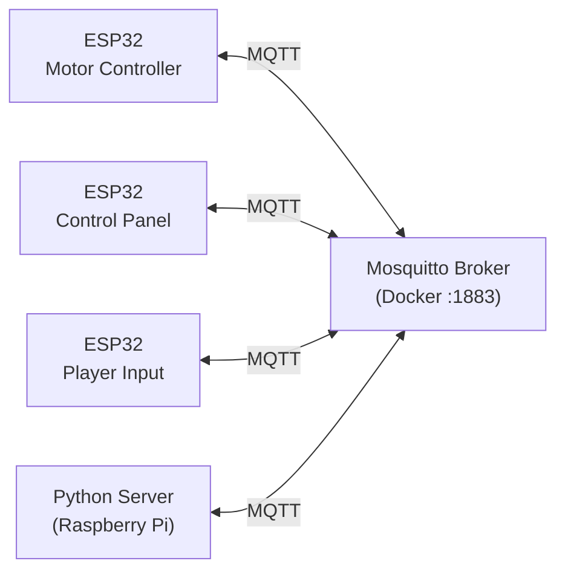
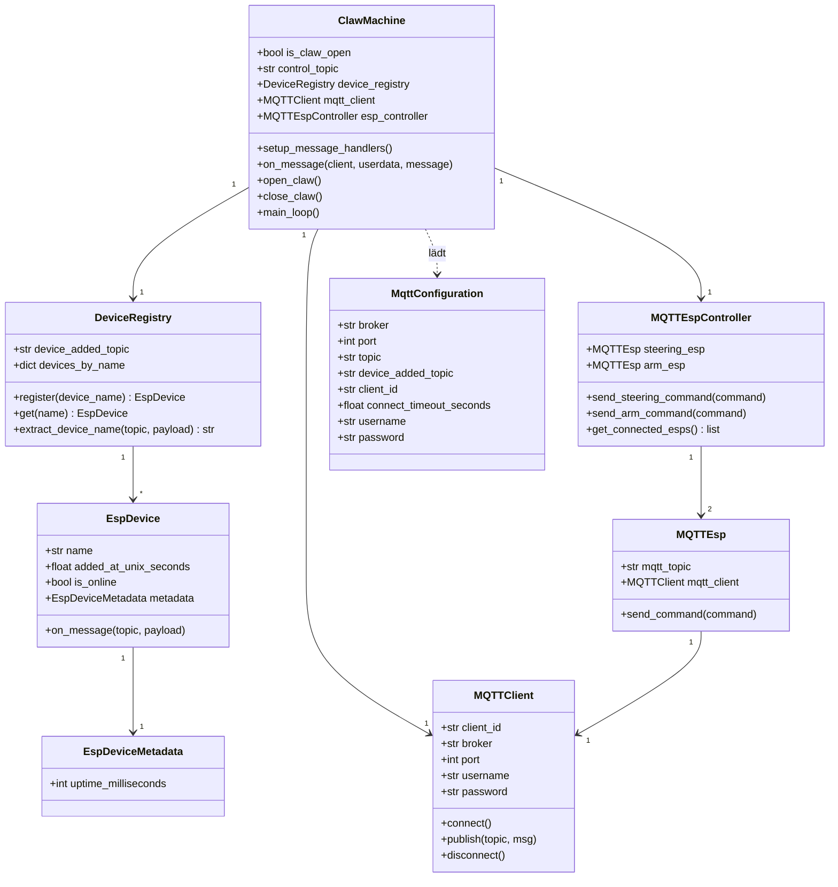
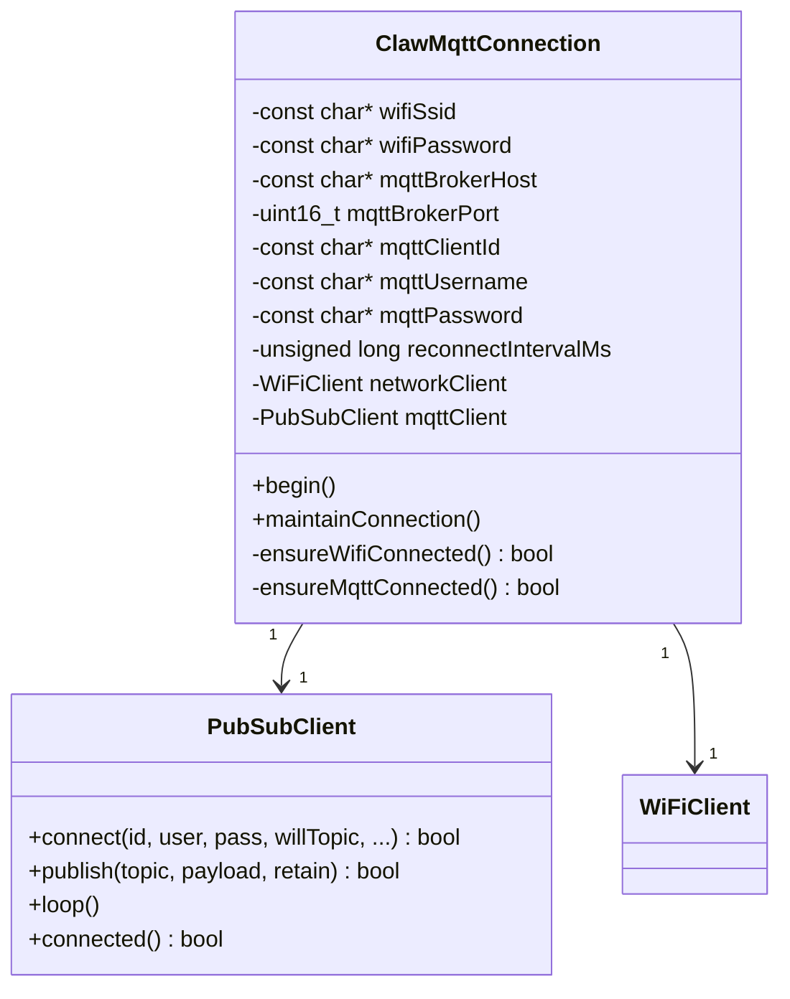

# Klassendiagramme

## Systemübersicht

---

## Python Server

---

## Firmware (ESP32)

### MQTT Topics (Firmware → Broker)

| Topic | Payload | Beschreibung |
|---|---|---|
| `clawmachine/<id>/metadata/uptime` | Millisekunden | Uptime seit Boot, alle ~20ms |
| `clawmachine/<id>/status` | `online` / `offline` | LWT: offline bei Verbindungsabbruch |

### MQTT Topics (Server → Broker)

| Topic | Payload | Beschreibung |
|---|---|---|
| `clawmachine/claw` | `open` / `close` | Greifer steuern |
| `clawmachine/device/steering/command` | Befehl | Steuerung ESP |
| `clawmachine/device/arm/command` | Befehl | Arm ESP |
